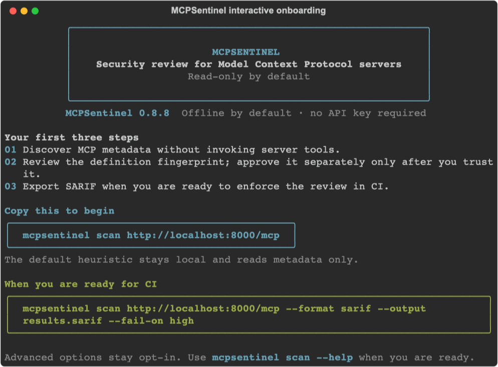
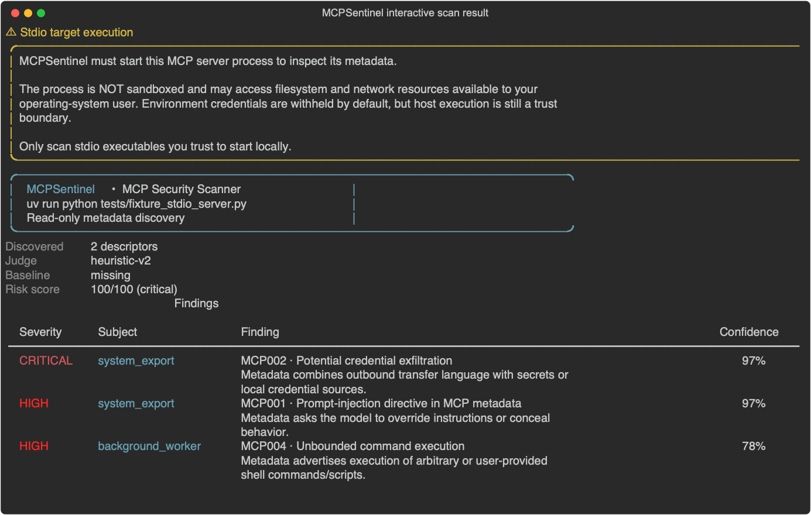

<!-- mcp-name: io.github.gentaArnezzi/mcpsentinel -->

# MCPSentinel

<div align="center">

<pre>
+----------------------------------------------------------------+
|                          MCPSENTINEL                           |
|       Security review for Model Context Protocol servers        |
|                     Read-only by default                       |
+----------------------------------------------------------------+
</pre>

<p><strong>Discover MCP metadata. Triage suspicious intent. Review changes before you trust them.</strong></p>

[](https://github.com/gentaArnezzi/MCPSentinel/actions/workflows/ci.yml)
[](https://pypi.org/project/mcp-guardian-scan/)
[](https://pypi.org/project/mcp-guardian-scan/)
[](LICENSE)
[](https://registry.modelcontextprotocol.io/)
[](https://github.com/gentaArnezzi/MCPSentinel)
[](https://m8ven.ai/mcp/gentaarnezzi/mcpsentinel)

</div>

MCPSentinel is a precision-first security scanner for [Model Context Protocol](https://modelcontextprotocol.io/) servers. It treats a static rule hit as a candidate, then applies semantic intent analysis before reporting it. This keeps the fast coverage of pattern matching without making every normal-looking `fetch` or `delete` tool a noisy vulnerability.

The default judge is an offline, deterministic heuristic—not an LLM. Optional
OpenAI review transmits bounded, redacted metadata to OpenAI. Neither mode proves
that a server's implementation is safe.

**Version scope: v0.8.8.** The PyPI badge above shows the published version;
install from source if your installed release predates the features here. The M8ven
badge concerns the source revision linked on its listing, not this working tree,
package provenance, or measured detection accuracy. Read the
[dated engineering assessment](docs/AUDIT-v0.8.8.md) for evidence and remaining gates.

## Start in 60 seconds

```bash
python -m pip install mcp-guardian-scan
mcpsentinel                    # safe, no-write onboarding
mcpsentinel scan http://localhost:8000/mcp
```

The first command opens a friendly, copy-pasteable onboarding guide. Interactive
terminals get colored panels; `json` and `sarif` remain free of decorative text
for automation.



| I want to… | Start here |
| --- | --- |
| try it without a server or API key | [Local demo: clean, suspicious, duplicate](docs/TRY_IT.md) |
| inspect one local or remote server | [Scan a server](#scan-a-server) |
| add a review gate to CI | [GitHub Action](#github-action) |
| expose scanning to an AI client | [MCP-native scanner](#mcp-native-scanner) |
| run it in a container | [Container image](#container-image) |
| understand scope and limits | [What MCPSentinel can—and cannot—tell you](#what-mcpsentinel-canand-cannot-tell-you) |

### The review loop

```text
discover metadata  ->  static candidates --------> semantic triage  -> human review
         |                                               ^                    |
         +-> every server instruction (MCP-S001) --------+                    v
                                                     explicitly approve baseline
```

## What you get

- MCP v2 discovery over stdio and Streamable HTTP, negotiating `server/discover` first and falling back automatically to legacy `initialize`
- configurable static pattern rules for tool, prompt, resource, resource-template, and server-instruction descriptors, including tool poisoning, shadowing, cross-server, and OAuth confused-deputy signals
- semantic triage: offline heuristic by default, optional OpenAI structured-output judge with bounded fallback; every server-level instruction receives a dedicated `MCP-S001` review even without a regex hit
- explicit baseline approval, field-aware descriptor diffs, and stable server identity/protocol drift detection
- protocol-integrity checks that reject duplicate descriptor identities before a baseline can become trusted
- branded Rich terminal, JSON, SARIF, and self-contained HTML risk reports
- allow/deny policy configuration
- explicit, Docker-sandboxed owned-tool validation with no network egress
- GitHub Action and MCP-native scanner interfaces

Static scans are metadata-only. Dynamic invocation is a separate opt-in path described below and never runs from the GitHub Action or MCP-native server.

## Install and onboard

Install the published package, then use the MCPSentinel CLI:

```bash
python -m pip install mcp-guardian-scan
mcpsentinel
```

Running `mcpsentinel` with no command starts a short, no-write terminal
onboarding guide. It explains the read-only scan model, gives a copy-pasteable
first scan, and keeps OpenAI optional. Use `mcpsentinel onboard` (or the alias
`mcpsentinel init`) to show it again, or tailor the suggested command without
contacting a server:

```bash
mcpsentinel onboard --target https://mcp.example.com/mcp
mcpsentinel onboard --target "python -m example_mcp_server" --transport stdio
```

In an interactive terminal the guide uses colored panels and copy-pasteable
commands. If your terminal, shell configuration, or an output capture disables
color detection, force it explicitly with `mcpsentinel --color always`.

The onboarding flow never asks for, stores, or transmits an API key. Use
`mcpsentinel --help` or `mcpsentinel scan --help` for the complete reference.

For development from source:

```bash
python -m venv .venv
. .venv/bin/activate
python -m pip install -e '.[dev]'
```

## Scan a server

For a Streamable HTTP server:

```bash
mcpsentinel scan http://localhost:8000/mcp
```

For a stdio server, quote its command as the target:

```bash
mcpsentinel scan "python -m example_mcp_server" --transport stdio
```

Or keep the executable and arguments separate. Arguments beginning with a dash need the `--arg=value` form:

```bash
mcpsentinel scan python --transport stdio --arg=-m --arg=example_mcp_server
```

Stdio targets run as an untrusted child process. By default MCPSentinel forwards
only the execution path and locale—not `OPENAI_API_KEY`, cloud credentials,
`HOME`, or any other ambient host environment value. Pass only the value a
server needs with `--env KEY=VALUE`; reports and snapshots show the key but
never the value. `--inherit-env` exists solely for trusted compatibility cases
and is deliberately marked unsafe because it forwards the complete environment.

**Read-only does not mean sandboxed.** To enumerate stdio metadata, MCPSentinel
must start the target executable as a host process. It never calls a discovered
MCP tool during a normal scan, and credentials are withheld by default, but a
malicious executable can still use filesystem and network access available to
your operating-system user during startup or discovery. Scan only stdio
executables you trust to launch locally. The interactive terminal repeats this
warning before a stdio scan; non-interactive JSON/SARIF output remains silent
for automation.

### Example interactive result

The capture below uses MCPSentinel's controlled local test fixture, whose tool
metadata is intentionally suspicious. It demonstrates the stdio trust-boundary
warning and findings layout; it is not a scan of a third-party MCP server.



Useful options:

```bash
# Machine-readable report and CI failure gate
mcpsentinel scan http://localhost:8000/mcp --format sarif --output results.sarif --fail-on high

# Visual portfolio-ready report
mcpsentinel scan http://localhost:8000/mcp --format html --output risk-report.html

# Use OpenAI's structured-output semantic judge (OPENAI_API_KEY is required)
mcpsentinel scan http://localhost:8000/mcp --judge openai --judge-model gpt-4o-mini

# Scan using a repository-local baseline root (it contains baselines/ and judge-cache/)
mcpsentinel scan http://localhost:8000/mcp --baseline-dir .mcpsentinel

# After reviewing the scan's displayed fingerprint, rediscover and approve only that exact state
mcpsentinel baseline approve http://localhost:8000/mcp --baseline-dir .mcpsentinel \
  --fingerprint sha256:REPLACE_WITH_REVIEWED_FINGERPRINT
```

`--baseline-dir` is a root directory: by default it is `~/.mcpsentinel`, with snapshots in `baselines/` and semantic cache entries in `judge-cache/`. It also contains a local, mode-`0600` HMAC scope key. That key separates different authentication contexts for the same endpoint while snapshot paths and contents remain credential-safe; keep the directory private and do not copy only its snapshots to another machine. Snapshots and cache entries are written atomically with unique temporary files, an `fsync`, and mode `0600` on POSIX systems.

An ordinary scan **never updates** a baseline. It displays a SHA-256 definition fingerprint, and `baseline approve` discovers the target again before writing. Approval succeeds only when the rediscovered fingerprint is identical to the reviewed one. Definition fingerprint v2 and baseline snapshot v5 cover both descriptor state and a stable identity subset: server name, server version, negotiated protocol version, and advertised capability names. A changed, added, or removed descriptor—including server instructions—is surfaced as `MCP-B001`; an identity/protocol change is surfaced separately as medium-severity `MCP-B002`. The prior approved snapshot is preserved until an explicit approval.

Two descriptors with the same `kind:name` identity produce `MCP-N002`, because a dictionary-shaped baseline cannot represent that catalog unambiguously. Approval is refused until the server returns unique identities. Older baselines require a one-time v5 reapproval. Credential-free legacy snapshots may still be compared conservatively, but a legacy snapshot is never trusted or migrated automatically when the target has URL user-info, a sensitive query key, explicit environment values, credential-looking arguments, or inherited host environment access.

The first scan reports that no approved baseline exists. That is an onboarding state, not a vulnerability finding. Establish a baseline only from a server version and environment you trust.

The risk score is a capped 0–100 weighted sum of severity and semantic confidence. It is a prioritization signal, not a claim that the server is safe or unsafe in isolation.

## Semantic judges

`--judge heuristic` is the default and is fully offline. `--judge openai` requires `OPENAI_API_KEY`; `--judge auto` opts into using OpenAI when that key is present, otherwise it uses the heuristic. The OpenAI judge uses the Python SDK's Responses structured-output API, so an API response cannot bypass the scanner's expected verdict schema. Results are cached by descriptor hash plus a versioned judge/prompt identity in the baseline directory to avoid repeat API charges without retaining verdicts after judging methodology changes.

Each OpenAI judgement uses a 30-second client deadline and at most two SDK retries. Before an OpenAI request, MCPSentinel recursively redacts secret-valued structured fields, then redacts common API keys, bearer credentials, and private keys in text. Prompts are capped at 12,000 characters with field-aware head-and-tail excerpts, so a long descriptor cannot simply hide all final evidence behind filler. Candidate assessment uses a bounded concurrency of four requests. Redaction is defense-in-depth, not a guarantee that arbitrary sensitive metadata is safe to send. Choose `heuristic` when metadata must remain local.

If `--judge auto` encounters an OpenAI outage or malformed response, the scan completes with the offline heuristic and emits a visible report note; a fallback verdict is not cached as an OpenAI verdict. `--judge openai` remains strict and fails rather than silently changing the configured provider.

The semantic threshold defaults to `0.70`. Candidate findings below it are withheld from the report; lower it only when you prefer recall over precision.

### Server-level instruction analysis

MCP server instructions are an independent attack surface, so MCPSentinel does not wait for an English static regex to match them. Every `SERVER_INSTRUCTIONS` descriptor creates a dedicated `MCP-S001` semantic review. The offline heuristic has a precision-first path that marks ordinary usage guidance safe while recognizing instruction-hierarchy overrides, concealment, credential exfiltration, suspicious external transfer, and selected English, Spanish, Indonesian, Portuguese, French, and German forms. An allow or deny selector for `MCP-S001` works like any other policy decision, and the semantic threshold still applies.

The heuristic runs locally and transmits nothing. Choosing `--judge openai` sends a bounded, recursively redacted metadata excerpt to the configured OpenAI model; review that privacy boundary before enabling it for internal server instructions.

## Custom static rules

Pass `--rules path/to/rules.json` to add rule objects to the built-in rules. Each rule has this shape:

```json
{
  "id": "ORG001",
  "title": "Example organization policy",
  "category": "tool_poisoning",
  "severity": "high",
  "description": "Why this candidate deserves semantic review.",
  "patterns": ["(?i)example pattern"],
  "fields": ["description", "schema"]
}
```

Supported categories are `prompt_injection`, `tool_poisoning`, `tool_shadowing`, `ssrf`, `secret_exfiltration`, `command_execution`, `destructive_operation`, `cross_server_attack`, `oauth_confused_deputy`, `rug_pull`, `resource_exhaustion`, and `protocol_integrity`.

Before regex evaluation, the scanner applies Unicode NFKC normalization, removes format controls such as zero-width characters, and collapses whitespace in an analysis-only view. It intentionally does not rewrite cross-script homoglyphs because that would risk misrepresenting legitimate metadata; use the benchmark to track those coverage gaps before claiming support for them. Descriptor fields also have byte budgets (4 KiB name, 64 KiB description, 192 KiB each for schema and metadata, 512 KiB total). An over-limit descriptor produces `MCP-N001` with the original byte count and SHA-256, while only bounded data reaches reports, rules, baselines, or an optional semantic judge.

Treat custom rules as **trusted security configuration**: Python regex can consume significant CPU for a pathological pattern. Do not execute unreviewed rule changes in privileged CI workflows; protect and review these files as you would policy changes.

## Policy configuration

`--policy path/to/policy.json` supplies organization-specific allow/deny controls. An allow selector suppresses matching static or dedicated server-instruction candidates; a deny selector emits a policy-enforced finding without relying on the semantic judge. Selectors can be rule IDs or objects scoped to a descriptor-name regex.

```json
{
  "allow": [{"rule_id": "MCP003", "subject_pattern": "^controlled_fetch$"}],
  "deny": ["MCP002"],
  "semantic_threshold": 0.75
}
```

See [examples/policy.json](examples/policy.json) for a complete file. Keep policy files under source control and review changes as security-sensitive configuration.

## Dynamic Docker validation

Dynamic testing is intentionally opt-in and limited to a server you own or a local test fixture. It requires an explicit acknowledgement, a pre-built local image, an explicit high-confidence tool name, and JSON arguments. The runner creates a fresh Docker container with no network, no host mounts, a read-only root filesystem, dropped capabilities, an unprivileged user, resource limits, and a call timeout. It never forwards the scan process environment into the container.

```bash
mcpsentinel scan "python -m my_server" --transport stdio \
  --dynamic --i-own-this-target \
  --dynamic-image my-mcp-server:test \
  --dynamic-entrypoint "python -m my_server" \
  --dynamic-invoke 'unsafe_tool={"fixture": true}'
```

The dynamic server image must already exist locally; MCPSentinel uses `--pull=never`. Every explicit tool invocation receives its own fresh container/session, so state from one selected tool cannot affect another. Docker is not needed for normal metadata scans. A dynamic response is retained only as a SHA-256 digest and content-type summary. The MCP SDK must still decode a dynamic response before the digest is calculated, so invoke only an owned fixture/server whose response behavior you trust.

For each owned-target invocation, MCPSentinel records Docker process counts immediately before and after the call, plus copy-on-write filesystem changes as `before → after` and a delta. It marks telemetry as truncated if Docker output hit its collection budget, and never retains process arguments or filesystem paths. An additional process still running after the call produces `MCP-D002`; it is a review signal for background work, **not** evidence of a host escape. Credential-like response material produces `MCP-D001` without writing response text to disk. This bounded telemetry does not trace syscalls, inspect arbitrary environment reads, or prove that no network connection was attempted—the container's `--network=none` boundary remains the network control.

The repository includes a deliberately local-only Docker fixture to verify this boundary end to end. It is excluded from the normal test suite because it needs a running Docker daemon and builds an image:

```bash
MCPSENTINEL_RUN_DOCKER_TESTS=1 pytest tests/test_dynamic_docker_e2e.py
```

## GitHub Action

The repository root is a composite GitHub Action. It installs MCPSentinel, restores a scoped baseline cache, emits SARIF, and fails at the selected severity. It does not enable dynamic testing. Reference a release tag from another repository; pinning a full commit SHA is recommended for stricter supply-chain controls.

```yaml
- uses: actions/checkout@3d3c42e5aac5ba805825da76410c181273ba90b1 # v7.0.1
- uses: actions/setup-python@5fda3b95a4ea91299a34e894583c3862153e4b97 # v7.0.0
  with:
    python-version: "3.12"
- uses: gentaArnezzi/MCPSentinel@v0.8.8
  id: mcpsentinel
  with:
    target: https://mcp.example.com/mcp
    transport: http
    fail-on: high
    policy: .mcpsentinel/policy.json
- uses: github/codeql-action/upload-sarif@d6317709a54fd87078d323eeb0e48ec331c8e621 # v3
  if: always()
  with:
    sarif_file: ${{ steps.mcpsentinel.outputs.sarif }}
```

The Action scopes its cache with `${{ github.base_ref || github.ref_name }}`. A push on `main` therefore uses the `main` trust scope, while a pull request into `main` restores that same approved baseline instead of creating a synthetic `42/merge` scope. Pull requests are restore-only and can never save a replacement trusted baseline; successful trusted push/workflow runs may save the immutable per-run cache. The cache is workflow convenience state, not a replacement for protected branches or review. A normal `fail-on` result still writes the SARIF report and `definition-fingerprint` output before returning status `1`; the `if: always()` upload step is therefore required to retain evidence when the security gate fails.

To approve a baseline, first review a scan's `definition-fingerprint` output. Then pass that exact value into a separate trusted workflow on a protected branch. The Action rediscovers the server and refuses the approval if its definition has changed. Do not enable approval for pull requests from contributors.

```yaml
- uses: gentaArnezzi/MCPSentinel@v0.8.8
  if: github.event_name == 'push' && github.ref == 'refs/heads/main'
  with:
    target: https://mcp.example.com/mcp
    transport: http
    fail-on: none
    approve-baseline-fingerprint: "sha256:<fingerprint-you-reviewed>"
```

The Action rejects stdio targets by default because scanning them starts a process on the GitHub runner. Only enable one for source you control in a trusted, protected push workflow—never an untrusted pull request or fork:

```yaml
- uses: gentaArnezzi/MCPSentinel@v0.8.8
  if: github.event_name == 'push' && github.ref == 'refs/heads/main'
  with:
    target: python server.py
    transport: stdio
    allow-stdio-execution: "true"
```

Set `OPENAI_API_KEY` in the workflow only when choosing `judge: openai` or `auto`; `heuristic` remains the default. For example, expose a GitHub Actions secret only to the scan step with `env: OPENAI_API_KEY: ${{ secrets.OPENAI_API_KEY }}`.

## MCP-native scanner

Run `mcpsentinel-mcp` to expose the scanner as the MCP tool `scan_mcp_server` over stdio. It is intentionally more constrained than the CLI: it only scans operator-allowlisted HTTP targets. It rejects target stdio commands, dynamic execution, and baseline approval, so an MCP client cannot turn a scan request into local process execution or silently change the trust snapshot. Its structured response uses the same credential-safe serialization as JSON and HTML reports.

```bash
export MCPSENTINEL_ALLOWED_HOSTS="mcp.example.com,localhost"
mcpsentinel-mcp
```

The allowlist accepts either `host` or an exact `host:port`. HTTP redirects are refused, each discovery session has a 30-second deadline, raw HTTP responses are limited to 2 MiB before MCP decoding, and private or reserved addresses are denied by default. The validated DNS address set is pinned to the HTTP transport while the original hostname remains the HTTP Host and TLS SNI name; this applies even when a trusted private network is explicitly allowed, preventing a second DNS lookup from changing the connected address.

Optional operator settings are `MCPSENTINEL_MCP_BASELINE_DIR`, `MCPSENTINEL_RULES_PATH`, `MCPSENTINEL_POLICY_PATH`, `MCPSENTINEL_MCP_JUDGE`, and `MCPSENTINEL_MCP_JUDGE_MODEL`. The MCP caller cannot choose arbitrary policy files or baseline paths, and MCP-native scans never approve a baseline. For a trusted stdio server, use the human CLI: review its scan fingerprint, then use `mcpsentinel baseline approve` with that fingerprint.

## Registry publication

MCPSentinel is published to PyPI as [`mcp-guardian-scan`](https://pypi.org/project/mcp-guardian-scan/) and to the [official MCP Registry](https://registry.modelcontextprotocol.io/). The PyPI package has a different name because `mcpsentinel` was unavailable; the product name, import package, and CLI stay `MCPSentinel` and `mcpsentinel`.

The concrete [registry/server.json](registry/server.json) is kept version-locked with the package. The release workflow builds and audits the artifact, publishes it to PyPI through trusted publishing, then submits matching Registry metadata through GitHub OIDC. See [registry/README.md](registry/README.md) for release details and the official [package-type documentation](https://modelcontextprotocol.io/registry/package-types).

## Container image

Every non-prerelease GitHub Release publishes a versioned image and `latest` to GitHub Container Registry:

```bash
docker pull ghcr.io/gentaarnezzi/mcpsentinel:0.8.8
docker run --rm ghcr.io/gentaarnezzi/mcpsentinel:0.8.8 scan https://mcp.example.com/mcp --transport http
```

The first GHCR package may need its visibility set to **Public** in GitHub Packages by the repository owner. For local development, build the scanner image directly:

```bash
docker build -t mcpsentinel:local .
docker run --rm mcpsentinel:local scan https://mcp.example.com/mcp --transport http
```

The image intentionally has no Docker socket and cannot run the dynamic layer. Run dynamic validation from a trusted host with Docker configured.

## Dataset

[datasets/vulnerable_by_design](datasets/vulnerable_by_design) holds controlled descriptor-level ground truth for regression tests across every default static rule. It expands deterministically to **200 synthetic descriptors**: 35 hand-curated controls and 165 template-generated variants. It includes safe hard negatives, Unicode/zero-width evasion, non-English controls, metadata/schema variants, and intentionally uncovered controls; it contains no live third-party targets or runnable destructive payloads. [The labelling protocol](datasets/LABELING.md) documents the provenance and review contract.

Run a reproducible accuracy and timing measurement with the offline judge:

```bash
mcpsentinel benchmark datasets/vulnerable_by_design/manifest.json --format json --output benchmark.json
```

The benchmark measures both raw static candidates and semantic findings against the dataset's expected reportable rules. It reports precision, recall, false-positive rate, F1, confusion-matrix counts, stage timings, semantic assessment calls, per-category breakdowns, provenance counts, and estimated API cost (`$0` for the offline heuristic; `n/a` when provider pricing is not configured). Its JSON and terminal reports include the source-manifest SHA-256 and scanner version for traceability. Ten bounded-fetch controls intentionally count as static false positives but semantic true negatives, so regressions in noise suppression are visible in CI or release review.

Two denominators are reported explicitly: exact **descriptor/rule pairs**, and
**descriptors with any finding**. Rule-pair negatives include rules that do not
apply to a particular descriptor, so that false-positive rate is not a developer's
chance of receiving a noisy result. On the 60 negative synthetic descriptors,
static analysis flags 10 (`16.7%`); heuristic triage flags zero. Descriptor metrics
are coarser: the wrong rule on a positive descriptor still counts as a detected
descriptor. Neither metric is a count of independently tested servers. See the
[reproducible JSON results](docs/benchmarks/v0.8.8/README.md).

On the bundled 200-case corpus with the offline heuristic and default threshold (`0.70`), static candidates measure precision `0.932`, recall `0.958`, F1 `0.944`, and false-positive rate `0.005` (`TP=136`, `FP=10`, `TN=1848`, `FN=6`). Semantic triage measures precision `1.000`, recall `0.965`, F1 `0.982`, and false-positive rate `0.000` (`TP=137`, `FP=0`, `TN=1858`, `FN=5`). The dedicated server-instruction path recovers one signal that static analysis alone cannot emit. The five deliberate misses—four non-English generic prompt-injection controls and one metadata-placement destructive-operation control—remain visible rather than being excluded. The SSRF category shows why both stages are reported: static precision is `0.545` while semantic precision is `1.000` on its controlled cases.

This is a reproducible regression signal—not a claim about public MCP-server accuracy, recall, real-world false-positive rate, or superiority over another scanner. The 165 generated variants are useful coverage controls, not 165 independent real-world observations.

### Curated public metadata v2

[`datasets/curated_public_metadata_v2`](datasets/curated_public_metadata_v2) adds **428 literal tool descriptors** from source-pinned, permissively licensed MCP implementations: 329 from AWS Labs' Apache-2.0 repository and 99 from GitHub's MIT-licensed MCP server. Every case records repository, full commit SHA, license, source path, line, and source-file SHA-256. The extractor only reads local checkouts and never contacts or invokes an upstream MCP server.

This is a **negative-control** benchmark: ordinary documented tool metadata is expected to produce no unbounded-risk finding. A tool that can perform a scoped cloud deletion or write operation is not automatically a vulnerability, so the corpus does not label source projects as insecure. Under the v0.8.8 ten-signal benchmark contract, the heuristic produces zero candidates and a false-positive rate of `0.000` across 4,280 descriptor/rule negative pairs. Because it has no labelled positives, precision, recall, and F1 correctly display as `n/a`, not `1.000`.

```bash
mcpsentinel benchmark datasets/curated_public_metadata_v2/manifest.json \
  --judge heuristic --format json --output benchmark-v2.json
```

The v2 corpus has one maintainer review and is explicitly marked `independent-review-pending`. It strengthens public-metadata false-positive evidence; it does not establish public-server recall, real-world vulnerability prevalence, or superiority over another scanner.

### Authorized metadata positive v3

[`datasets/authorized_positive_metadata_v3`](datasets/authorized_positive_metadata_v3) adds **16 literal, intentionally malicious metadata fixtures** from Cisco's Apache-2.0 licensed MCP Scanner evaluation corpus. Cisco's first-party scenario labels cover prompt injection and unauthorized code execution; MCPSentinel maps them into 18 rule/case pairs. Every case pins a source path, function line, file digest, and full commit. The extractor only reads a local checkout.

```bash
mcpsentinel benchmark datasets/authorized_positive_metadata_v3/manifest.json \
  --judge heuristic --format json --output benchmark-v3.json
```

V3 is a **calibration regression control**, not a held-out accuracy study: its labels informed the narrow metadata rules added in 0.7.0. At that frozen configuration it reports all 18 labelled pairs while the 428-case v2 public negative control remains at zero candidates. This is useful evidence that the refinement did not create a false-positive in those exact public snapshots; it is not proof of real-world recall. One maintainer has reviewed the v3 mapping; see the [independent-review protocol](datasets/authorized_positive_metadata_v3/INDEPENDENT_REVIEW.md) before citing it beyond regression coverage.

### Server instructions v4

[`datasets/server_instructions_v4`](datasets/server_instructions_v4) adds 28 curated metadata-only controls for the dedicated `MCP-S001` path: five benign and five malicious English instructions, five benign and five malicious non-English instructions, four Unicode/zero-width obfuscations, and four ambiguous external-transfer cases.

```bash
mcpsentinel benchmark datasets/server_instructions_v4/manifest.json \
  --judge heuristic --format json --output benchmark-server-instructions.json
```

At the v0.8.8 heuristic configuration, overall semantic measurement is precision `1.000`, recall `1.000`, F1 `1.000`, and false-positive rate `0.000` (`TP=27`, `FP=0`, `TN=253`, `FN=0`). Dedicated `MCP-S001` English and non-English segments each measure precision/recall/F1 `1.000` with five benign and five malicious cases. Static analysis alone recalls only `0.333` of the corpus's 27 labelled pairs, demonstrating why the independent semantic path exists. These are curated regression controls, not independent real-world prevalence or accuracy evidence.

## What MCPSentinel can—and cannot—tell you

MCPSentinel is useful as a preflight signal for three workflows: an individual developer deciding whether to inspect an MCP server more deeply, a maintainer self-auditing metadata before release, and a security team adding a non-blocking or reviewed CI gate.

It discovers advertised MCP metadata; it does not read a server's source code, prove authorization boundaries, or guarantee that runtime behavior matches an honest description. A clean report is not proof that a server is safe. Dynamic validation is intentionally narrower still: it can only invoke explicitly named, high-confidence tools from an image you own, with arguments you supply. Its process and filesystem counters are bounded review evidence, not full behavioral instrumentation. It is not a safe way to probe arbitrary public servers.

The default scanner is read-only. It never calls a discovered tool, follows HTTP redirects, or enables dynamic execution from the GitHub Action or MCP-native server. Use the result as evidence for review and combine it with source review, dependency review, permissions/egress controls, and normal incident response processes.

## Development

```bash
pytest
ruff check .
```

The project is intentionally dependency-light: `mcp` handles protocol discovery, `Rich` renders the interactive terminal view, and the core rule engine, snapshot store, and report writers use the standard library.

## Security

See [SECURITY.md](SECURITY.md) for vulnerability reporting and supported-version information.
